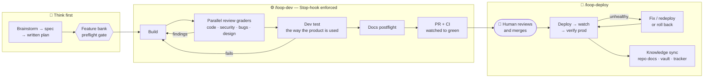

<div align="center">

# 🛤️ wayworks

**An open-source way of work for AI-assisted building.**

Claude Code plugins with second-brain (Obsidian) support and tracker (Linear) integration —
your agent plans, builds, reviews, tests, ships, and documents. You review and merge.

[](CHANGELOG.md)
[](#-plugin-catalog)
[](#-plugin-catalog)
[](LICENSE)
[](CONTRIBUTING.md)

[Install](#-install) · [The pipeline](#-the-pipeline) · [Daily loops](#-daily-loops) · [Plugin catalog](#-plugin-catalog) · [Setup](#-per-project-setup) · [Author](#-author)

</div>

---

Every project lives in a linked triangle — **repo ↔ second brain ↔ tracker** — and every feature travels a gated pipeline where the agent cannot declare "done" until something measurable agrees. 14 plugins, 43 skills (5 of them stack profiles), 6 commands, and 5 sub-agents.

- `/wayworks-init` — bootstrap a repo: plugin fleet, CLAUDE.md header, verify gate
- `/wayworks-onboard` — link a project's triangle: repo ↔ second brain ↔ tracker

**Core** (enable everywhere): `shared`, `harness`, `security`, `test-builder`, `feature-bank`. **Extended** (enable per stack): everything else — `/wayworks-init` picks the right set for a repo.

## 🔁 The pipeline



The `Stop` hooks are the point: a loop cannot end while the verify gate is red, reviews are unstamped, or prod is unhealthy — and circuit breakers stop it from looping forever.

## ⚡ Install

```bash
claude plugin marketplace add SilviaAre95/wayworks
```

Then either bootstrap a repo with the whole fleet in one step — install `shared`, run `/wayworks-init` inside the repo — or install plugins individually:

<details>
<summary><b>Install plugins one by one</b></summary>

```bash
claude plugin install shared@wayworks
claude plugin install architect@wayworks
claude plugin install backend-dev@wayworks
claude plugin install frontend-dev@wayworks
claude plugin install test-builder@wayworks
claude plugin install qa@wayworks
claude plugin install data-engineer@wayworks
claude plugin install devops@wayworks
claude plugin install security@wayworks
claude plugin install design@wayworks
claude plugin install tech-writer@wayworks
claude plugin install pm@wayworks
claude plugin install harness@wayworks
claude plugin install feature-bank@wayworks
```

</details>

<details>
<summary><b>Local development (from a clone)</b></summary>

```bash
git clone https://github.com/SilviaAre95/wayworks.git
cd wayworks

# Load a single plugin
claude --plugin-dir ./plugins/architect

# Load multiple plugins
claude --plugin-dir ./plugins/shared --plugin-dir ./plugins/architect --plugin-dir ./plugins/backend-dev
```

</details>

## 🗺️ How it's used

**One-time setup**
1. Install the marketplace and the core plugins (above), or let `/wayworks-init` do it per repo.
2. *Recommended*: point your global `~/.claude/CLAUDE.md` at your Obsidian vault (one line: where it lives and that repo CLAUDE.md files reference notes inside it). The vault is the knowledge layer — project notes, PRDs, decisions — and what `/wayworks-onboard` links against.
3. *Optional*: connect a tracker. Linear (via the claude.ai connector) gets the deepest integration; GitHub Issues or a backlog inside your vault work too — the commands adapt to what you have.

**Per project**
- `/wayworks-onboard <name-or-idea>` — takes inventory (repo? vault note? tracker project?), creates only what's missing, and wires the links between all three. Works from a bare idea (vault note + tracker only) up to a fully existing project (links only).
- `/wayworks-init` — inside a repo: detects the stack, enables the right plugin fleet in committed `.claude/settings.json` (so your whole team gets it on clone), scaffolds the CLAUDE.md config header, and hands off to `/harness-init` for the verify gate.

> **Adapts to your setup**: no vault → knowledge lives in `docs/`; no Linear → pick Obsidian checkboxes, GitHub Issues, or `docs/BACKLOG.md`. Obsidian + Linear is the recommended pairing, not a requirement.

## 🔄 Daily loops

| Loop | What it does |
|------|--------------|
| Front half | superpowers `brainstorming` → spec → `writing-plans`, then hand the plan to the loop: `/loop-dev --plan docs/superpowers/plans/<plan>.md` |
| `/loop-build` | Build-test-fix until the verify gate is green |
| `/loop-dev` | Full feature loop: spec preflight → plan → build → parallel review/security/bug (+ optional design) subagents → dev test → docs postflight → PR + CI watch |
| `/loop-deploy` | Deploy → watch → verify prod → fix/redeploy or roll back → sync repo docs, vault log, and Linear |

Between loops: `feature-bank` guards scope on every code edit; review/test/security skills run on demand; browser verification via Claude's built-in browser tooling or `chrome-devtools-mcp`.

## 🧩 Plugin catalog

### Core tier — enable everywhere

<details>
<summary><b>shared</b> — coding conventions, meta-skills, and stack profiles</summary>

| Skill | Description |
|-------|-------------|
| `/conventions` | Apply wayworks working conventions — simplicity-first, explicit errors, conventional commits (language-agnostic) |
| `/create-skill` | Generate a new SKILL.md with proper frontmatter and structure |
| `/wayworks-init` | Bootstrap a repo as a wayworks workspace — plugin fleet in `.claude/settings.json`, CLAUDE.md header, harness handoff |
| `/wayworks-onboard` | Onboard a project from any starting point — create + link Linear project ↔ vault note ↔ repo, adapting to what exists |

**Stack profiles** (auto-loaded based on project files — this is where language/stack opinions live):
- `nextjs-vercel` — Next.js App Router + TypeScript style + Tailwind/Prisma + Vercel conventions
- `expo-mobile` — Expo Router, secure storage, permissions, EAS build/release
- `python-gcp` — FastAPI/Flask + GCP (Cloud Run, BigQuery, Pub/Sub)
- `terraform` — IaC module structure, state management, provider conventions
- `generic` — Language-agnostic fallback conventions

</details>

<details>
<summary><b>harness</b> — tiered autonomy + Stop-gated verification loops</summary>

Ships hooks (auto-approve reads, `Stop`-gate loop enforcement), templates, and its own test suite. See [plugins/harness/README.md](plugins/harness/README.md).

| Command | Description |
|---------|-------------|
| `/harness-init` | Set up the harness in a project — verify gate (`.cc-verify`), loop configs, gitignore |
| `/loop-build` | Build-test-fix loop that runs until the verify gate is green |
| `/loop-dev` | Staged dev loop: spec preflight → plan (`--plan <path>`) → build → review subagents → dev test → docs postflight → PR + CI watch |
| `/loop-deploy` | Prod deploy loop: deploy → watch → verify → fix/redeploy until healthy, rollback on exhaustion; knowledge sync on success |

</details>

<details>
<summary><b>feature-bank</b> — source-of-truth feature specs that stop agent drift</summary>

| Skill | Description |
|-------|-------------|
| `/feature-bank` | Enforce `/docs/features/` specs before any code change; interactive backfill for existing codebases |

</details>

<details>
<summary><b>security</b> — code and infrastructure security</summary>

Includes `vuln-scanner` sub-agent.

| Skill | Description |
|-------|-------------|
| `/code-audit` | OWASP Top 10 code audit — injection, auth, data exposure |
| `/dependency-check` | Audit dependencies for CVEs, outdated packages, bloat |
| `/iam-review` | Review auth flows, RBAC, sessions, API key management |
| `security-scan` | Supply-chain scan of agent configs (requires external `ecc-agentshield` via npx) |

</details>

<details>
<summary><b>test-builder</b> — test generation across all layers</summary>

| Skill | Description |
|-------|-------------|
| `/unit-tests` | Generate isolated unit tests with edge cases and mocks |
| `/integration-tests` | Generate integration tests with real database |
| `/e2e-tests` | Generate Playwright/Cypress end-to-end tests |

</details>

### Extended tier — enable per stack

<details>
<summary><b>architect</b> — system design and architecture decisions</summary>

Includes `design-reviewer` and `security-reviewer` sub-agents.

| Skill | Description |
|-------|-------------|
| `/system-design` | Design system architecture — components, data flow, infra |
| `/tradeoff-analysis` | Compare options with structured pros/cons/recommendation |
| `/adr-writer` | Write + manage ADRs — generates records, scaffolds docs/adr/, list/status modes |

</details>

<details>
<summary><b>backend-dev</b> — API and database development patterns</summary>

| Skill | Description |
|-------|-------------|
| `/api-design` | Design REST/GraphQL endpoints with schemas and validation |
| `/db-schema` | Design or review Prisma database schemas |
| `/error-handling` | Implement structured error handling patterns |

</details>

<details>
<summary><b>frontend-dev</b> — React/Next.js component development and review</summary>

| Skill | Description |
|-------|-------------|
| `/component-builder` | Scaffold React components with types, a11y, and Tailwind |
| `/styling-review` | Review Tailwind usage, design consistency, and patterns |
| `/accessibility-check` | WCAG 2.1 AA code audit + UX experience mode (screen reader, keyboard, low vision, motor, cognitive) |

</details>

<details>
<summary><b>design</b> — layout, design systems, usability, and user flows</summary>

| Skill | Description |
|-------|-------------|
| `/layout-review` | Visual hierarchy, spacing, alignment + responsive breakpoints and touch targets |
| `/design-system` | Audit, scaffold, or extend a Tailwind design system |
| `/heuristic-eval` | Nielsen's 10 heuristics evaluation with severity ratings |
| `/user-flow-analysis` | Map user flows, identify friction and drop-off risks |

</details>

<details>
<summary><b>qa</b> — quality assurance and regression analysis</summary>

Includes `regression-scanner` sub-agent.

| Skill | Description |
|-------|-------------|
| `/edge-case-finder` | Identify edge cases, boundary conditions, and failure modes |
| `/bug-review` | Analyze bug reports, find root causes, verify fixes |
| `/regression-check` | Trace code changes for potential regressions |

</details>

<details>
<summary><b>data-engineer</b> — data pipeline and SQL workflows</summary>

| Skill | Description |
|-------|-------------|
| `/pipeline-design` | Design ETL/ELT pipelines with monitoring and error handling |
| `/schema-review` | Review schemas for normalization, indexes, naming |
| `/sql-optimizer` | Analyze and optimize SQL queries |
| `/pipeline-verify` | Run a pipeline against a bounded sample in dev; assert schema, row accounting, idempotency, clean logs |

</details>

<details>
<summary><b>devops</b> — infrastructure, containers, and CI/CD</summary>

Includes `deploy-checker` sub-agent.

| Skill | Description |
|-------|-------------|
| `/dockerfile` | Generate or review multi-stage Dockerfiles |
| `/ci-pipeline` | Generate CI/CD configs (GitHub Actions, Railway, Vercel) |
| `/infra-review` | Review Docker, CI, deploy, env vars, production readiness |

</details>

<details>
<summary><b>tech-writer</b> — documentation generation</summary>

| Skill | Description |
|-------|-------------|
| `/readme-gen` | Generate README by analyzing project code and config |
| `/api-docs` | Generate API docs from route handlers (markdown or OpenAPI) |

</details>

<details>
<summary><b>pm</b> — product management and planning</summary>

| Skill | Description |
|-------|-------------|
| `/user-stories` | Generate user stories with acceptance criteria |
| `/task-breakdown` | Break features into tasks with estimates and dependencies |
| `/prd-writer` | Generate PRDs with problem, solution, scope, metrics |

</details>

### Sub-agents

| Plugin | Agent | Purpose |
|--------|-------|---------|
| architect | `design-reviewer` | Reviews system designs for security, scalability, ops |
| architect | `security-reviewer` | Focused security review of architecture decisions |
| qa | `regression-scanner` | Traces code changes through dependency graph |
| devops | `deploy-checker` | Pre-deployment validation (build, lint, env, migrations) |
| security | `vuln-scanner` | OWASP Top 10 vulnerability scanning |

## 🧰 Per-project setup

The easiest path is `/wayworks-init`, which writes this for you. Manually, drop into your project's `.claude/settings.json` (committed, so the whole team gets the same fleet on clone):

```json
{
  "extraKnownMarketplaces": {
    "wayworks": { "source": { "source": "github", "repo": "SilviaAre95/wayworks" } }
  },
  "enabledPlugins": {
    "shared@wayworks": true,
    "harness@wayworks": true,
    "security@wayworks": true,
    "test-builder@wayworks": true,
    "feature-bank@wayworks": true,
    "superpowers@claude-plugins-official": true
  }
}
```

Then add the stack-specific set:

- **Full-stack web app**: + `architect`, `backend-dev`, `frontend-dev`, `design`
- **Backend API service**: + `architect`, `backend-dev`, `data-engineer`, `devops`
- **Data platform**: + `data-engineer`, `devops`
- **Infrastructure / Terraform**: + `devops`
- **Planning & design** (no code): `architect`, `pm`, `tech-writer` only

<details>
<summary><b>Install with scope</b></summary>

```bash
# Project scope (committed, shared with team)
claude plugin install architect@wayworks --scope project

# Local scope (gitignored, personal)
claude plugin install architect@wayworks --scope local
```

</details>

## ✍️ Adding new skills

Use the `create-skill` meta-skill:

```
/create-skill my-new-skill architect "Design microservice boundaries"
```

Or see [plugins/shared/skills/create-skill/SKILL.md](plugins/shared/skills/create-skill/SKILL.md) for the full template reference. Contributions follow the release rule in [CLAUDE.md](CLAUDE.md) — see [CONTRIBUTING.md](CONTRIBUTING.md).

<details>
<summary><b>Repo structure</b></summary>

```
wayworks/
├── .claude-plugin/
│   └── marketplace.json
├── plugins/
│   ├── shared/           # Conventions, meta-skills, stack profiles
│   ├── architect/        # System design, tradeoffs, ADRs
│   ├── backend-dev/      # API, database, error handling
│   ├── frontend-dev/     # Components, styling, a11y
│   ├── test-builder/     # Unit, integration, e2e tests
│   ├── qa/               # Edge cases, bugs, regressions
│   ├── data-engineer/    # Pipelines, schemas, SQL, pipeline-verify
│   ├── design/           # Layout+responsive, design system, heuristics, user flows
│   ├── devops/           # Docker, CI/CD, infra
│   ├── security/         # Code audit, deps, IAM
│   ├── tech-writer/      # README, API docs, ADR templates
│   ├── pm/               # User stories, tasks, PRDs
│   ├── harness/          # Autonomy tiers, verify loops, hooks, templates, tests
│   └── feature-bank/     # Feature-spec governance + check-bank.sh validator
│       ├── .claude-plugin/
│       │   └── plugin.json
│       ├── skills/         # (or commands/ for harness + shared)
│       │   └── <skill-name>/
│       │       └── SKILL.md
│       └── agents/         # (plugins with sub-agents)
│           └── <agent-name>.md
├── CHANGELOG.md
├── CLAUDE.md             # Release rule: version bump + CHANGELOG on any plugins/ change
└── README.md
```

</details>

## 👋 Author

**Silvia Arellano** — data platform architect. Consults through **OBEXDATA**, builds in public at [silviadata.dev](https://www.silviadata.dev).

wayworks grew out of real production incidents — the stories behind these gates (including the app that failed to deploy for 34 days without anyone noticing) are on Medium.

[](https://www.silviadata.dev)
[](https://medium.com/@silvia.datadev)
[](https://github.com/SilviaAre95)

## 📄 License

[MIT](LICENSE) — use it, fork it, make it your own way of working.
